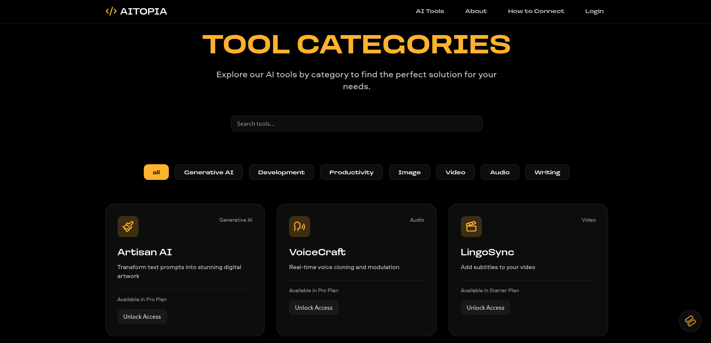

# AItopia 🚀

Welcome to **AItopia**, an innovative AI-powered platform that brings cutting-edge tools to creators, developers, and businesses. Whether you're generating stunning artwork, analyzing data, or enhancing productivity, AItopia offers a seamless and intuitive experience to unlock the full potential of artificial intelligence.


## 🌟 Features

- **Diverse AI Tools**: Access a suite of tools including Artisan AI for digital art, VoiceCraft for voice modulation, LingoSync for video subtitles, and more.
- **User-Friendly Dashboard**: Manage your profile, subscriptions, and analytics with an elegant, responsive interface.
- **Flexible Plans**: Choose from Starter, Pro, or Enterprise packages tailored to your needs, with customizable tool selections.
- **Secure Authentication**: Robust user authentication and settings management for a personalized experience.
- **Scalable Backend**: Powered by Node.js and Prisma, ensuring high performance and reliability.
- **Modern Frontend**: Built with Next.js, Tailwind CSS, and TypeScript for a fast and beautiful UI.

## 🛠️ Tech Stack

### Frontend
- **Next.js**: React framework for server-side rendering and static site generation.
- **TypeScript**: Strongly-typed JavaScript for enhanced developer experience.
- **Tailwind CSS**: Utility-first CSS framework for rapid and responsive design.
- **Framer Motion**: Smooth animations for a polished UI.
- **Lucide React**: Lightweight icon library for consistent visuals.

### Backend
- **Node.js & Express**: Fast and scalable server-side framework.
- **Prisma ORM**: Modern database access with type-safe queries.
- **TypeScript**: Ensures robust and maintainable server code.
- **CORS & Authentication**: Secure API endpoints with middleware.

### Database
- **Prisma with PostgreSQL/MySQL**: Flexible schema management and migrations (configured in `prisma/schema.prisma`).


## 🚀 Getting Started

### Prerequisites
- **Node.js**: v18 or higher
- **npm**: v9 or higher
- **Database**: PostgreSQL or MySQL (configured via Prisma)
- **Environment Variables**:
  - Frontend: `.env.local` with `NEXT_PUBLIC_API_BASE_URL`
  - Backend: `.env` with `DATABASE_URL`, `PORT`, `NEXT_FRONTEND_URL`

### Installation

1. **Clone the Repository**:
   ```bash
   git clone https://github.com/yourusername/AItopia.git
   cd AItopia
   ```

2. **Set Up Frontend**:
   ```bash
   cd frontend
   npm install
   ```
   Create a `.env.local` file:
   ```
   NEXT_PUBLIC_API_BASE_URL=http://localhost:5000/api
   ```

3. **Set Up Backend**:
   ```bash
   cd ../backend
   npm install
   ```
   Create a `.env` file (use `.env.example` as a template):
   ```
   DATABASE_URL="your-database-connection-string"
   PORT=5000
   NEXT_FRONTEND_URL=http://localhost:3000
   ```

4. **Initialize Database**:
   ```bash
   cd backend
   npx prisma migrate dev
   ```

5. **Run the Application**:
   - Start the backend:
     ```bash
     cd backend
     npm run dev
     ```
   - Start the frontend:
     ```bash
     cd frontend
     npm run dev
     ```
   - Open `http://localhost:3000` in your browser.

## 🖼️ Screenshots

| Dashboard | Tool Selection |
|-----------|----------------|
|  |  |

## 🔧 Available Scripts

### Frontend
- `npm run dev`: Run the development server.
- `npm run build`: Build for production.
- `npm run start`: Serve the production build.
- `npm run lint`: Run ESLint for code quality.

### Backend
- `npm run dev`: Run with nodemon for auto-reload.
- `npm run start`: Run the production server.
- `npx prisma migrate dev`: Apply database migrations.
- `npx prisma studio`: Launch Prisma Studio for database management.

## 🌐 API Endpoints

- **Users**: `/api/users/profile`, `/api/users/notifications`, `/api/users/subscription`
- **Tools**: `/api/tools` (list available tools)
- **Payments**: `/api/create-razorpay-order`, `/api/verify-razorpay-payment`

> **Note**: Authentication required for most endpoints (Bearer token).

## 🤝 Contributing

We welcome contributions! Please follow these steps:

1. Fork the repository.
2. Create a feature branch (`git checkout -b feature/YourFeature`).
3. Commit your changes (`git commit -m 'Add YourFeature'`).
4. Push to the branch (`git push origin feature/YourFeature`).
5. Open a Pull Request.


## 📬 Contact

- **GitHub Issues**: [Create an issue](https://github.com/nitindahiya-dev/AItopia/issues)

---

Built with 💻 and ☕ by the Me. Let’s shape the future of AI together! 🌍

